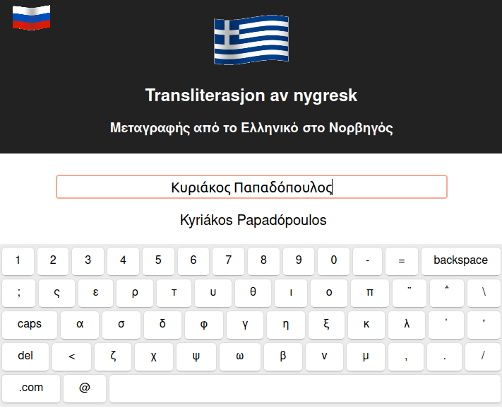
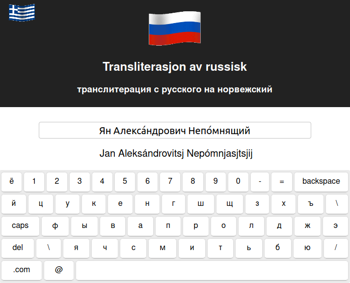

This project is made using Github Pages to transiterate Greek and Russian into Norwegian. It uses Language Council of Norway's (Språkrådet) official [transliteration guide](https://www.sprakradet.no/sprakhjelp/Skriverad/Transkripsjon_av_kyrillisk_og_nygresk/). The actual website is found [here](https://thdb-theo.github.io/Greek-Norwegian-Transliteration/)

## Examples

